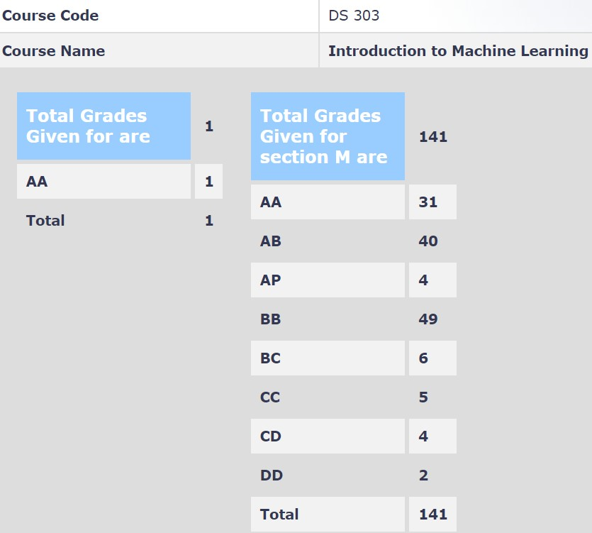

**Review by**

Nivedya S Nambiar, 2023(BTech.)

**Course Offered In**

Spring 2022

**Instructors**

Prof. Biplab Banerjee

**Prerequisites**

No hard prerequisites, only basic programming, linear algebra, and calculus

**Difficulty**

2/5, Introductory course in ML

**Course Content**

The course primarily covered the following -

1. Linear and logistic regression
2. Basics of convex optimisation
3. Probabilistic classifiers (Naive Bayes, Gaussian Mixture Models)
4. Decision Tree
5. Ensemble learning (Random Forests)
6. K-nearest neighbours
7. Neural networks and CNNs
8. Support Vector Machines
9. Dimensionality Reduction using PCA
 
**Feedback on Lectures**

The lectures were all online and were easy to follow, only requiring that the student is well-versed with the portions covered in previous lectures. The class had students from both DS 303 and GNR 652. There were weekly tutorials at 7PM every Wednesday, held by the teaching assistants to give a glimpse of the implementation of the ideas introduced in the lectures. The professor was also open to conducting doubt clearing sessions, even one-on-one. The lecture slides did cover the main aspects of the lecture, but to understand the contents, it is best to keep track of lectures by attending them. Reference material for each topic was shared by the professor and TA's, and additional material for better understanding can be easily found online.

**Feedback on Evaluations**

1. 50% Quizzes (3-20,15,15) 
2. 25% Assignments (2)
3. 25% Endsem/Course Project

The quizzes were based out of the lecture content and tutorials, however, looking up additional reference material to better understanding is advisable to ace in the quizzes. There was no midsem in the course. Students had a choice between a course project (in a group of 4) and an endsem for the final evaluation. Choice of project topics was the students' discretion.

**Study Material and References**

1. Understanding Machine Learning: From Theory to Algorithms; By Shai Shalev-Shwartz and Shai Ben-David
2. Pattern recognition and machine learning by Christopher Bishop, 
Springer Verlag, 2006.
3. Hastie, Tibshirani, Friedman The elements of Statistical Learning 
Springer Verlag
4. T. Mitchell. Machine Learning. McGraw-Hill, 1997.
5. Deep Learning by Ian Goodfellow, Yoshua Bengio and Aaron Courville, 
MIT Press, 2016 (some chapters). 

Additional resources were shared by the instructor for each lecture as needed.

**Final Takeaways**

Although this course is offered by the CSRE department, it is included in the bucket for the DH minor, along with EE 769. This course does not cover aspects exclusive to healthcare informatics, but provides a fairly basic introduction to machine learning which proves an important tool for the domain.

**Grading Statistics:**

